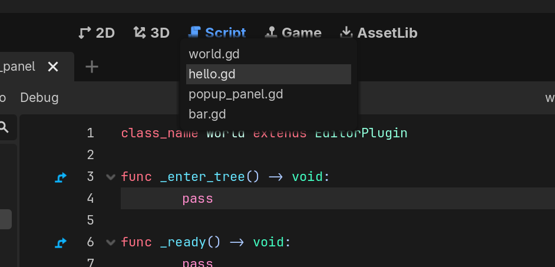

+++
date = '2026-04-16T09:02:11-04:00'
title = 'First Godot Plugin'
type = 'logs'
tags = ["tutorial", "programming"]
description = "Walkthrough of my process for creating a GDExtension using godot-cpp for the Godot Game Engine."
draft = true
+++

## What?
This is a plugin for the [Godot Game Engine](https://godotengine.org/) created with [godot-cpp](https://github.com/godotengine/godot-cpp) that provides quick switching between recently opened scripts using a *currently* hardcoded keyboard shortcut: `Ctrl + Tab`. This is a recreation of VSCode's Quick Open for MRU (Most Recently Used) files, improving workflow efficiency for developers who are familiar with this ... workflow. Mainly just a pain point for **me** working in Godot - and that's all that matters.


## Code examples

Here is a block of code:

```cpp
void main ()
{
        std::cout << "test" << std::endl;
}

```

## Image example


## Requirements
I needed a few things to develop this plugin on my Windows 11 PC.
