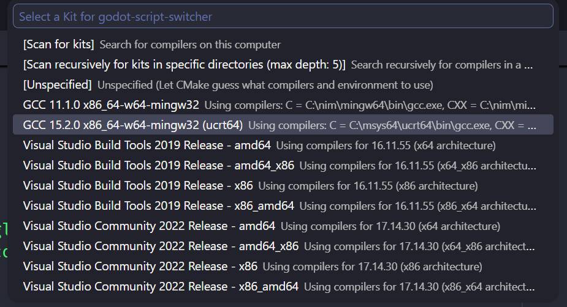

+++
date = '2026-04-22T09:02:11-04:00'
title = 'Making a C++ Godot Plugin'
type = 'logs'
tags = ["projects", "tutorial", "programming", "godot"]
description = "Walkthrough of my process for creating a c++ plugin for Godot."
draft = false
+++

I made a plugin ([here](/projects/godot-script-switcher)) for [Godot](https://godotengine.org/) via GDExtension using [godot-cpp](https://github.com/godotengine/godot-cpp) bindings.

\
It's a recreation of VSCode's Quick Open for MRU (Most Recently Used) files in Godot simply to make my life a bit easier as I hate being pulled away from the keyboard so much while writing code inside Godot.

\
I want to share the process here should anyone else be interested in creating their own Godot plugins with c++.

# Process
<!--  -->
> I will describe the steps I took to get my environment setup for developing this specific plugin. As I developed this plugin on windows, these steps will reflect that. However, it **should** be trivial to change things for yourself to focus on either linux or mac.

## Dependencies

1. [C++ Compiler (GCC)](#installing-c-compiler--setup)
2. [CMake](#installing-cmake--setup)
3. [CMake Tools (VSCode)](#install-cmake-tools-for-vscode)

### Installing C++ Compiler & Setup
I used [Msys2](https://www.msys2.org/) to install mingw64. Once **Msys2** is installed, add the bin dir to your **sys env** path. For example: `C:\msys2\ucrt64\bin`.

> **NOTE**: Because windows, I had to signout and sign back in to get the sys env changes to take affect.

Once **Msys2** is installed, you can launch the `MSYS2 UCRT46` shell and then install mingw via the pacman package manager.
For example:
```bash
pacman -S --needed base-devel mingw-w64-ucrt-x86_64-toolchain
```

> **NOTE**: If missing **gdb**, install with `pacman -S mingw-w64-ucrt-x86_64-gdb`.

I finally verified gcc & gbd by running both `gcc --version` & `gdb --version` via cmd shell.

### Installing CMake & Setup

CMake is not the build generator/system that Godot uses, that would be SCons, but I am familiar with CMake so that's what I used despite the friction. I installed **CMake** for windows [here](https://cmake.org/download/).

### Install CMake Tools for VSCode

Searched for CMake Tools via VSCode's extension manager and then installed it.

## CMake File
This was a large part of the project, made more complicated due to the fact that I wanted to create a workflow in GitHub Actions to build and publish releases - so I need this rock-solid.

\
[Here](https://github.com/Travlee/godot-script-switcher/blob/main/CMakeLists.txt) is what I ended up with and it *works perfectly on my machine* (also multiple gh runners). This is not intended to be a full CMake breakdown, but I will explain a few parts that required some discovery.

### CMake Version
The gh runners have CMake version `3.31.0` installed, so `cmake_minimum_required(VERSION 3.31.0...4.3.0)` is the solution to that. Not necessarily critical but worth noting.

### Fetching godot-cpp
I really like making use of `FetchContent` in CMake, so I did it here for godot-cpp. There was also some reason as to why I fetched it as a release/zip versus cloning, I forget now. I can only do so much.

```CMake
# i like my external libs in a special dir
set(EXTERNAL_DIR "${CMAKE_CURRENT_SOURCE_DIR}/external/")

include(FetchContent)

FetchContent_Declare(
        godot-cpp
        URL https://github.com/godotengine/godot-cpp/archive/refs/tags/godot-4.5-stable.zip
        SOURCE_DIR     ${EXTERNAL_DIR}godot-cpp
)
FetchContent_MakeAvailable(godot-cpp)
```

### Configuring godot-cpp

Something important to note about using CMake instead of SCons, godot-cpp would just keep building in debug mode. Which is fine until you want to publish it and don't want a massive dll.

\
To solve that, I had to set an **env var** to force it to follow our CMake build type.

```CMake
# Store build-type to suffix for use with godot-cpp and dir names
if(CMAKE_BUILD_TYPE STREQUAL "Debug")
        set(SUFFIX "debug")
else()
        set(SUFFIX "release")
endif()

# this is the important bit
set(GODOTCPP_TARGET "template_${SUFFIX}")
```

### Linking godot-cpp

Now all that is left was to link `godot-cpp` to my project.

```CMake
target_link_libraries(${CMAKE_PROJECT_NAME} godot-cpp)
```


## VSCode Setup

I had to select the correct `gcc` for `CMake Tools` in `VSCode`. Which was simply done by pressing `Ctrl + Shift + P` then typing `cmake` then selecting my GCC installed via `Msys2`.

\


\
Now I could build my plugin in `VSCode` by pressing `F7`. Build times were okay on my laptop with 16 cores.


## Code

Now to the actual work of writing the plugin.